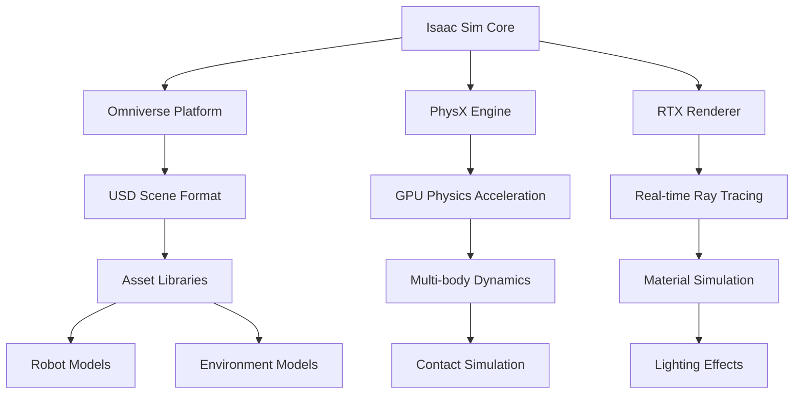

# The Isaac Ecosystem

The NVIDIA Isaac ecosystem is a comprehensive platform that encompasses simulation, perception, navigation, manipulation, and deployment tools specifically designed for GPU-accelerated robotics. Understanding the complete ecosystem is essential for leveraging Isaac's capabilities effectively.

## Isaac Platform Architecture

### Core Components

The Isaac ecosystem consists of several interconnected components:

#### Isaac Sim (Simulation)
- **GPU-accelerated Simulation**: Leverages NVIDIA RTX technology for photorealistic rendering
- **PhysX Integration**: Advanced physics simulation with GPU acceleration
- **Synthetic Data Generation**: Tools for creating large training datasets
- **Isaac Gym**: Reinforcement learning environment with GPU-accelerated physics

#### Isaac ROS (Robotics Middleware)
- **GPU-accelerated Nodes**: Perception and processing nodes optimized for GPU
- **CUDA Integration**: Direct integration with CUDA for custom acceleration
- **Sensor Processing**: GPU-accelerated sensor data processing
- **Computer Vision**: Optimized computer vision algorithms for robotics

#### Isaac Apps (Complete Applications)
- **Navigation App**: Complete navigation solution with GPU acceleration
- **Manipulation App**: Complete manipulation solution
- **Perception App**: Complete perception pipeline
- **Reference Implementations**: Production-ready reference implementations

#### Isaac Helpers (Development Tools)
- **Utility Functions**: Helper functions for common robotics tasks
- **Configuration Management**: Tools for managing Isaac configurations
- **Message System**: Isaac's message passing system
- **Logging and Debugging**: Advanced debugging and logging tools

## Isaac Sim: GPU-Accelerated Simulation

### Key Features

Isaac Sim provides advanced simulation capabilities:

#### Photorealistic Rendering
- **RTX Ray Tracing**: Real-time ray tracing for realistic lighting and reflections
- **Material Accuracy**: Accurate simulation of material properties and lighting
- **Sensor Simulation**: Realistic camera, LiDAR, and other sensor simulation
- **Environmental Effects**: Weather, lighting, and atmospheric effects

#### Physics Simulation
- **PhysX Integration**: NVIDIA's PhysX physics engine with GPU acceleration
- **Multi-body Dynamics**: Complex multi-body system simulation
- **Soft Body Simulation**: Deformable object simulation capabilities
- **Fluid Simulation**: Water and other fluid dynamics simulation

#### Synthetic Data Generation
- **Large Dataset Creation**: Tools for generating large datasets for AI training
- **Domain Randomization**: Techniques to improve sim-to-real transfer
- **Annotation Tools**: Automatic data annotation for training
- **Variety of Scenarios**: Tools for creating diverse training scenarios

### Isaac Sim Architecture

## Isaac ROS: GPU-Accelerated ROS Nodes

### GPU-Accelerated Perception

Isaac ROS provides GPU-accelerated versions of common ROS nodes:

#### Stereo Rectification
- **Real-time Processing**: GPU-accelerated stereo image rectification
- **High-resolution Support**: Support for high-resolution stereo cameras
- **Low-latency Operation**: Minimal processing latency for real-time applications

#### Depth Estimation
- **Stereo Depth**: GPU-accelerated stereo depth estimation
- **Structured Light**: GPU processing for structured light systems
- **ToF Processing**: Time-of-flight sensor processing acceleration

#### Object Detection
- **TensorRT Integration**: Optimized inference with TensorRT
- **Multi-class Detection**: Real-time detection of multiple object classes
- **3D Object Detection**: GPU-accelerated 3D object detection and localization

### Isaac ROS Packages

#### Core Packages
- **isaac_ros_visual_slam**: GPU-accelerated visual SLAM
- **isaac_ros_point_cloud_localizer**: Point cloud-based localization
- **isaac_ros_apriltag**: GPU-accelerated AprilTag detection
- **isaac_ros_dnn_inference**: GPU-accelerated deep neural network inference

#### Sensor Packages
- **isaac_ros_stereo_image_rectification**: Stereo image rectification
- **isaac_ros_image_pipeline**: GPU-accelerated image processing pipeline
- **isaac_ros_compressed_image_transport**: GPU-accelerated image compression

### Performance Benefits

GPU acceleration provides significant performance improvements:

| Task | CPU Performance | GPU Performance | Improvement |
|------|----------------|-----------------|-------------|
| Stereo Processing | 10 FPS | 60+ FPS | 6x |
| Object Detection | 5 FPS | 30+ FPS | 6x |
| SLAM | 5 FPS | 30+ FPS | 6x |
| Point Cloud Processing | 15 FPS | 60+ FPS | 4x |

## Isaac Navigation

### GPU-Accelerated Path Planning

Isaac Navigation leverages GPU acceleration for advanced navigation:

#### Global Path Planning
- **GPU-optimized Algorithms**: A*, Dijkstra, and other algorithms optimized for GPU
- **Dynamic Replanning**: Real-time path replanning with GPU acceleration
- **Multi-goal Planning**: Planning for multiple goals simultaneously

#### Local Path Planning
- **GPU-based Obstacle Avoidance**: Real-time obstacle detection and avoidance
- **Dynamic Window Approach**: GPU-accelerated DWA implementation
- **Trajectory Optimization**: GPU-accelerated trajectory optimization

#### Costmap Processing
- **GPU-accelerated Costmap**: Real-time costmap updates with GPU
- **Multi-layer Costmaps**: Efficient processing of multiple costmap layers
- **Dynamic Obstacle Integration**: Real-time integration of dynamic obstacles

## Isaac Manipulation

### GPU-Accelerated Manipulation

Isaac Manipulation provides tools for GPU-accelerated robotic manipulation:

#### Grasping
- **GPU-accelerated Grasp Planning**: Real-time grasp planning with GPU
- **Force Optimization**: GPU-based force optimization for stable grasps
- **Multi-finger Grasping**: GPU-accelerated multi-finger grasp planning

#### Trajectory Planning
- **GPU-based IK Solvers**: Inverse kinematics solvers optimized for GPU
- **Collision Detection**: GPU-accelerated collision detection
- **Trajectory Optimization**: GPU-accelerated trajectory optimization

#### Object Manipulation
- **Physics Simulation**: GPU-accelerated physics for manipulation simulation
- **Force Control**: GPU-accelerated force control algorithms
- **Compliance Control**: GPU-based compliance control for safe manipulation

## Isaac Apps: Complete Solutions

### Navigation App

The Isaac Navigation App provides a complete navigation solution:

#### Components
- **Global Planner**: GPU-accelerated global path planning
- **Local Planner**: GPU-accelerated local path planning and obstacle avoidance
- **Localization**: GPU-accelerated localization algorithms
- **Sensor Processing**: GPU-accelerated sensor data processing

#### Features
- **Real-time Performance**: Maintains high frame rates for real-time navigation
- **Multi-robot Support**: Support for coordinating multiple robots
- **Dynamic Obstacles**: Real-time detection and avoidance of dynamic obstacles
- **Recovery Behaviors**: GPU-accelerated recovery behaviors

### Manipulation App

The Isaac Manipulation App provides a complete manipulation solution:

#### Components
- **Grasp Planning**: GPU-accelerated grasp planning
- **Motion Planning**: GPU-accelerated motion planning
- **Control Interface**: GPU-accelerated control algorithms
- **Perception Pipeline**: GPU-accelerated perception for manipulation

#### Features
- **Real-time Grasping**: Real-time grasp planning and execution
- **Force Control**: GPU-accelerated force control for safe manipulation
- **Learning-based Grasping**: Integration with learning-based grasping approaches
- **Multi-object Manipulation**: GPU-accelerated multi-object manipulation

## Isaac Helpers and Development Tools

### Isaac Message System

The Isaac message system provides efficient communication:

#### Features
- **Zero-copy Messaging**: Efficient message passing with minimal copying
- **GPU Memory Support**: Direct support for GPU memory in messages
- **Serialization**: Efficient serialization of complex data structures
- **Multi-language Support**: Support for C++, Python, and other languages

### Isaac Configuration System

#### JSON-based Configuration
- **Hierarchical Configuration**: Organized configuration in JSON format
- **Component-specific Parameters**: Configuration parameters for each component
- **Runtime Reconfiguration**: Ability to reconfigure components at runtime
- **Validation**: Configuration validation and error checking

### Isaac Logging and Debugging

#### Advanced Logging
- **GPU Event Logging**: Logging of GPU events and performance metrics
- **Component-specific Logging**: Detailed logging for each component
- **Performance Profiling**: Built-in performance profiling tools
- **Visualization Tools**: Tools for visualizing Isaac system state

## Integration with Other NVIDIA Technologies

### CUDA Integration
- **Direct CUDA Access**: Components can directly access CUDA for custom acceleration
- **Memory Management**: Efficient GPU memory management across components
- **Stream Synchronization**: Proper CUDA stream synchronization

### TensorRT Integration
- **Model Optimization**: TensorRT optimization for deep learning models
- **Inference Acceleration**: GPU-accelerated inference for robotics AI
- **Model Deployment**: Tools for deploying optimized models

### cuDNN and cuBLAS
- **Deep Learning Primitives**: Optimized deep learning operations
- **Linear Algebra**: GPU-accelerated linear algebra operations
- **Signal Processing**: GPU-accelerated signal processing operations

The Isaac ecosystem provides a comprehensive platform for GPU-accelerated robotics development, from simulation to deployment. Understanding these components and their interactions is crucial for leveraging Isaac's full potential in robotics applications.